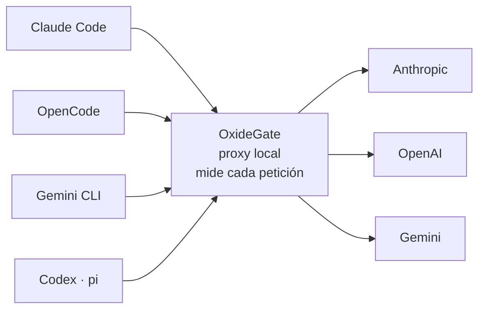
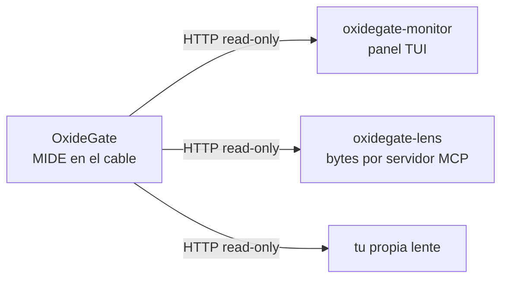
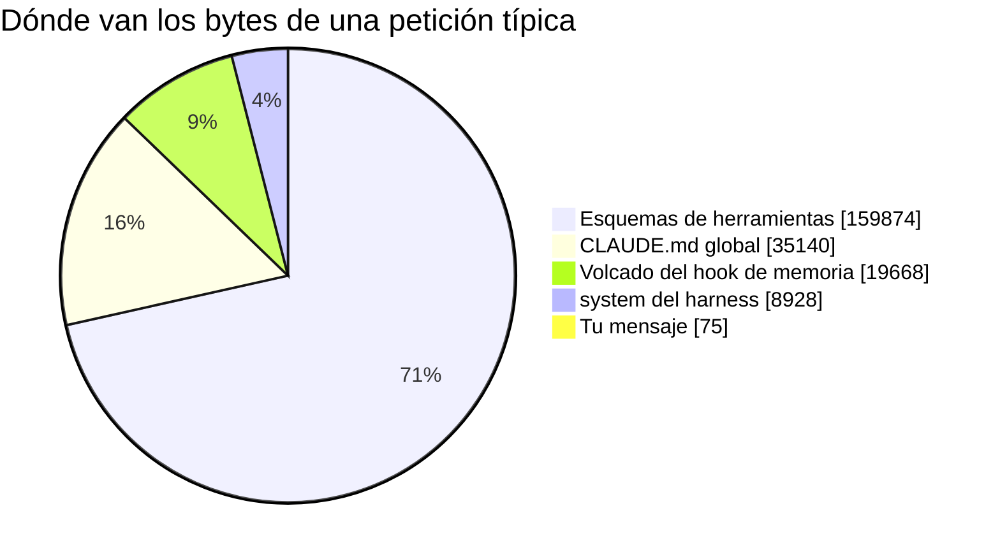

# OxideGate

[](https://crates.io/crates/oxidegate)
[](https://deepwiki.com/pichu2707/OxideGate)

> Proxy local en Rust que se sienta entre los clientes de IA (gentle-ai,
> agentes, SDKs, Claude Code) y los proveedores (Anthropic, OpenAI, Gemini).
> **Mide** cada petición —coste, tokens, latencia— por proveedor **y por
> modelo**, y empieza a **optimizar** el tráfico sin romper la transparencia.

El principio, no negociable:

> **No se puede optimizar lo que no se mide.**

Primero medimos cada petición real (Nivel 1). Sobre esa medición construimos las
optimizaciones (Nivel 2: caché, dedup, enrutado por coste) y comprobamos su
impacto **en vivo**, comparando el antes y el después.

---

## En 30 segundos



Apuntas tus clientes al proxy en vez de al proveedor. La petición viaja
**intacta** —tu autenticación incluida— y de paso queda medida. Un solo sitio
donde ver el gasto de todos los modelos y todas las herramientas a la vez.

---

## El ecosistema

OxideGate no es una herramienta suelta: es **el medidor** de un sistema con
varias piezas. La separación importa más de lo que parece.

| Repo | Papel |
|---|---|
| **OxideGate** | Mide en el cable. Única fuente de verdad. Publica `GET /stats`, `GET /requests` y `GET /sessions` |
| **`oxidegate-monitor`** | Dashboard TUI en vivo. Vive en **este mismo repo** y se instala con el proxy |
| [`oxidegate-lens`](https://github.com/pichu2707/oxidegate-lens) | Lente **read-only**: bytes por servidor MCP y ahorro por petición (`oxidegate-savings`, `oxidegate-mcp`) |
| [`homebrew-tap`](https://github.com/pichu2707/homebrew-tap) | Distribución — `brew install pichu2707/tap/oxidegate` |
| [`mcp-savings`](https://github.com/pichu2707/mcp-savings) | Enfoque anterior: medía desde el host, no desde el cable. **Superseded** (ver [mcp-savings#1](https://github.com/pichu2707/mcp-savings/issues/1)) |

### La dirección del dato

Es lo único que hay que entender de verdad:



**El dato solo fluye del proxy hacia las lentes, nunca al revés.** Las lentes
interpretan, agrupan y presentan; **ninguna mide nada por su cuenta**. Si un
número no salió de OxideGate, no existe.

Eso es lo que hace que un desacuerdo entre dos vistas sea siempre un bug de
presentación y nunca dos mediciones que compiten — la trampa en la que cayó
`mcp-savings`, que medía desde el host y por eso podía contradecir al cable.

### El contrato HTTP es público

`GET /stats`, `GET /requests` y `GET /sessions` son JSON sin autenticación
sobre `127.0.0.1`. **Cualquiera puede escribir su propia lente**: no hace
falta permiso, ni un plugin, ni tocar este repo. Basta con leer esas rutas.

Y `GET /version` dice qué versión del contrato sirve el proxy que tienes
delante y qué campos publica, para que una lente pueda distinguir *«este
proxy no lo soporta»* de *«aquí no había dato»* sin sondear por ausencia.

El contrato campo a campo está en
[`docs/telemetry-per-request.md`](docs/telemetry-per-request.md); las reglas
de qué es aditivo y qué es ruptura, en su
[§8](docs/telemetry-per-request.md).

---

## El hallazgo: tu pregunta es el 0,03% de lo que subes

Petición real de un agente, **225.798 bytes**. Esto es lo que iba dentro:



| Bloque | Bytes | % del body |
|---|---:|---:|
| Esquemas de herramientas (`tools`) | 159.874 | **70,8%** |
| `CLAUDE.md` global, inyectado como `<system-reminder>` | 35.140 | 15,6% |
| Volcado del hook `SessionStart` de memoria | 19.668 | 8,7% |
| `system` del harness | 8.928 | 4,0% |
| **El mensaje del usuario** | **75** | **0,03%** |

Del body, el **78,2%** es maquinaria de contexto —releer y reescribir el
prefijo— y solo el **3,0%** es input genuinamente nuevo.

> **Estos porcentajes son de BYTES, no de dinero — y la diferencia es grande.**
>
> Con caché activa, los bytes que subes y los tokens que pagas están
> **desacoplados**: el prefijo estable se lee al 10% de la tarifa y tu turno
> nuevo se paga entero. Medido sobre 133 peticiones de `claude-opus-4-8`, la
> misma sección cambia de peso según en qué unidad la mires:
>
> | Sección | % de los BYTES | % de lo PAGADO |
> |---|---:|---:|
> | `tools` | 56,1% | 22,5% |
> | `history` | 31,9% | 43,5% |
> | **el turno nuevo** | **7,8%** | **31,1%** |
>
> O sea que **medir en bytes SUBESTIMA unas 4x lo que cuesta tu pregunta**. El
> 0,03% de arriba es una cifra real y sigue siendo el argumento —la mayor parte
> de lo que subes no lo escribiste tú—, pero es una cifra de bytes: no la leas
> como tu factura.
>
> Por eso `GET /requests` publica `cache_by_section`, que estima qué cubo cayó
> dentro del prefijo cacheado. Ver
> [`docs/telemetry-per-request.md` §4.11](docs/telemetry-per-request.md).

---

## Y empeora en cada turno

> **El coste de una conversación crece N², no N.**
> Cada turno relee el prefijo entero, y el prefijo crece con cada turno.

La caché no lo arregla: **cambia el precio, no la cantidad**. Un token cacheado
sube igual por el cable, ocupa la misma ventana de contexto y pasa por prefill
igual. Cuesta el 10% de la tarifa de input, en cada turno, para siempre. No
existe "cachear al abrir el proyecto": la API es sin estado y una conversación
es su lista de mensajes completa, repetida en cada request.

---

## Las palancas que funcionan (medidas, no supuestas)

| Palanca | Efecto medido | Lo que cuesta |
|---|---|---|
| `mcp-lean.json` + `--strict-mcp-config` | **−55.098 B** por petición | Nada, si esos servidores no se usaban |
| `--tools <lista>` | **−94,9%** del array de esquemas | Ese agente ya no edita, ni busca por patrón, ni delega |
| Las dos apiladas | 224.653 B → **51.540 B** (**−77,1%**) | Las dos renuncias a la vez |
| `CLAUDE.md` lean | **−29.509 B** por petición | El 85,1% del archivo era flujo, no regla |
| `--effort low` | **−20,0%** tokens de salida, **−22,0%** de reloj | Cero en exactitud: 45/45 sobre respuesta cerrada — pero tareas abiertas sin medir |
| ↳ **y el proxy ya la aplica** | Palanca B: `OXIDEGATE_FORCE_EFFORT=low` | Apagada por defecto. La fila declara la intervención — ver [`docs/optimizer-effort.md`](docs/optimizer-effort.md) |

Y dos creencias extendidas, refutadas con grupo de control:

> **Marcar una tool con `defer_loading` cuesta 21 bytes y no quita ninguno.**
> El esquema viaja completo. La carga diferida ahorra **contexto**, no **cable**.

> **Gemini CLI cobra 288 B por skill y, en `gemini -p`, no declara la
> herramienta para canjearlos.** Su prompt manda llamar `activate_skill`; en
> headless esa herramienta no está entre las once que envía. **En interactivo
> sí**: llegan 36 tools y `activate_skill` es una de ellas. Dos sondas por modo.
> El listado que se paga es el mismo; lo que cambia es si se puede canjear.

> **`disable-model-invocation: true` hace que una skill cueste CERO bytes.** No
> se lista, así que no se paga en ninguna petición. En esta máquina son 11 de
> 22 skills. Es la única palanca del eje que no recorta nada: elimina el coste
> entero de lo que el modelo no debería elegir solo.

> **Las skills sí son perezosas: 200.601 B en disco → ~1,5 kB al cable.** Solo
> viaja el listado, a **138 B por skill**. Pero **invocar** una cuesta el
> cuerpo entero del `SKILL.md` — y entra en el historial, que se reenvía en
> cada turno: invocar `branch-pr` una vez equivale a declarar **42 skills
> más**. Detalle en
> [`docs/optimizer-skills.md`](docs/optimizer-skills.md).

---

## Lo que todavía NO está medido

Esta tabla existe para que nadie confunda una intención con un resultado. Es la
misma disciplina que el resto del proyecto: un dato ausente se declara ausente.
Cada hueco tiene su issue, y todas viven en el
[project](https://github.com/users/pichu2707/projects/13): declarar la deuda y
seguirla son lo mismo.

| Superficie | Estado |
|---|---|
| Esquemas MCP, `CLAUDE.md`, historial, `system`, último turno | ✅ Medido en bytes, por petición |
| Tokens, coste, TTFT y latencia por proveedor y modelo | ✅ Medido, del `usage` real |
| Cuota de suscripción (Codex/ChatGPT) | ✅ Medida, de las cabeceras `x-codex-*` |
| Declarar una skill (el listado) | ✅ **138 B por skill** con 11 skills; **242 B** con 66, donde el 86% son de plugin — ver [`docs/fixed-toll-claude-code.md`](docs/fixed-toll-claude-code.md) §3 |
| **El peaje fijo de una sesión** | ✅ **69.613 B** antes de escribir nada: `CLAUDE.md` 48% + hooks 29% + listado de skills 23% — ver [`docs/fixed-toll-claude-code.md`](docs/fixed-toll-claude-code.md) |
| Invocar una skill (el cuerpo) | ✅ **`SKILL.md` − frontmatter + ~300 B**, y el historial lo reenvía cada turno — ver [§7](docs/optimizer-skills.md) |
| `AGENTS.md` | ✅ Medido: **Claude Code no lo manda**, 0 B — ver [§4](docs/optimizer-skills.md) |
| Skills de plugin | ✅ **182 B**, igual que una propia — el origen no exime. Ver [§6](docs/optimizer-skills.md) |
| Separar comandos de skills en el listado | ⛔ **Imposible desde el cable**: aparecen en el mismo bloque, mismo formato, sin marca. Medido — ver [§4.8](docs/telemetry-per-request.md) |
| `AGENTS.md` en Codex, `pi` y OpenCode | ✅ Los tres lo mandan: **+159 B / +200 B / +160 B** sobre un fichero de 74 B. Claude Code, 0 B. Ver [§6](docs/skills-across-tools.md) |
| **Skills atribuidas POR PETICIÓN** en `/requests` | ✅ Campo `skills` con `declared`, `listing_bytes` y `format` — ver [`docs/telemetry-per-request.md`](docs/telemetry-per-request.md) §4.8 |
| **El `CLAUDE.md` atribuido POR PETICIÓN** en `/requests` | ✅ Campo `instructions` con `bytes` y `format`: **33.716 B medidos en el cable**. Delimitado por su envoltorio, nunca por una cabecera — el corte ingenuo daba 8.254 B. Para escala, el bloque es el 48% del peaje fijo según [`docs/fixed-toll-claude-code.md`](docs/fixed-toll-claude-code.md) §1, que es **otra captura**. Ver [§4.13](docs/telemetry-per-request.md) |
| **Qué cubo cayó dentro del prefijo cacheado** | ✅ Campo `cache_by_section` — el único ESTIMADO del contrato, por eso va anidado y con su `method` versionado. Ver [§4.11](docs/telemetry-per-request.md) |
| Coste de `gpt-5.5` y `gpt-5.6-sol` | ✅ Tarifados. Y el descuento de caché **no es uniforme dentro de OpenAI**: 0,5 en la familia 4o, 0,1 en la familia 5 |
| Comparar el coste de skills entre herramientas | ✅ Medido en 4 clientes: **138 B/skill en Claude Code, 390 B en Codex** — ver [`docs/skills-across-tools.md`](docs/skills-across-tools.md) |
| Invocar una skill en Gemini, opencode y Codex | ✅ Medido: opencode **3.335 B**; Codex **no tiene mecanismo** (lee el fichero); Gemini declara `activate_skill` en interactivo y **no en `-p`** — ver [§7](docs/skills-across-tools.md) |
| **`activate_skill` en el modo interactivo de Gemini** | ✅ Medido: **sí la declara** (36 tools frente a 11 en `-p`), 2/2 sondas. El PORQUÉ sigue sin aislar — ver [§7](docs/skills-across-tools.md) |
| Bytes de bajada | ✅ Campo `response_bytes` — **sin comprimir**, ver [`docs/telemetry-per-request.md`](docs/telemetry-per-request.md) §4.9 |
| Bytes de subida, en `GET /requests` | ✅ Campo `prompt_bytes` — **no es wire**: en Codex y Gemini se mide descomprimido, y con la Palanca A el body reenviado es mayor. Ver [`docs/telemetry-per-request.md`](docs/telemetry-per-request.md) §4.10 |
| **Gasto por sección** | ✅ `input_share_by_section`: qué fracción del input PAGADO es cada cubo, ponderada por caché. **Fracciones, nunca euros** — ver [§4.12](docs/telemetry-per-request.md) |
| El **peaje fijo** de cada herramienta (misma tarea trivial) | ✅ Medido en las cuatro — ver [`docs/floor-across-tools.md`](docs/floor-across-tools.md) |
| **Comparar herramientas sobre una tarea REAL** (con n>1 y tarea verificable) | ❌ Sin medir: gasta cuota y no es determinista — [#29](https://github.com/pichu2707/OxideGate/issues/29) |
| Agregación por sesión | ✅ `GET /sessions` — ver [`docs/telemetry-by-session.md`](docs/telemetry-by-session.md) |
| Panel de sesión en el monitor TUI | ✅ Tecla `e` — ver [`docs/monitor-tui.md`](docs/monitor-tui.md) §12 |
| **Persistencia del agregado entre reinicios** | ✅ **Al arrancar se relee `telemetry.jsonl`** y se reconstruyen `/stats` y `/sessions`. Ventana de 7 días por defecto, `OXIDEGATE_HISTORY_DAYS` la cambia y `0` la desactiva. `GET /history` dice desde cuándo mide — ver [`docs/history-rehydration.md`](docs/history-rehydration.md) |
| **Consultar los agregados por rango** | ✅ `GET /stats?since=7d` y `?since=2026-07-24`, igual en `/sessions`. Un `since` ilegible da **400**, nunca todo el histórico — ver [`docs/history-rehydration.md`](docs/history-rehydration.md) §6 |
| **El dialecto NATIVO de ollama** | ✅ `/api/generate` y `/api/chat`. Es **NDJSON, no SSE**, y el escáner exigía `data:` a todo el mundo: contra este dialecto habría publicado **cero tokens en silencio**. Ver [§4.18](docs/telemetry-per-request.md) |
| **La energía de una petición local** | ✅ `energy_wh` + `energy_idle_wh` + `power_peak_w` + `energy_samples`, solo con upstream **local**. Con upstream remoto es `null`: muestrear tu GPU mientras responde Anthropic mide tu escritorio. Ver [§4.19](docs/telemetry-per-request.md) |
| **Cuánta energía cuesta cargar el modelo** | ✅ **43 W de media contra ~189 W generando.** Cargar mueve memoria, no calcula: es el 54% del tiempo y el 11% de la energía. Corrige una afirmación anterior de este mismo repo que decía 2,5× — ver [§4.18](docs/telemetry-per-request.md) |
| **Repartir la energía entre peticiones SOLAPADAS** | ⛔ **No se puede con estos datos.** El campo dice «lo que gastó la máquina mientras esta petición estuvo abierta», no «lo que costó esta petición»: dos ventanas que se pisan reclaman los mismos vatios y **sumar la columna es inválido**. Declarado y fijado en test, no descubierto sumando |
| **La energía de la CPU, y macOS** | ❌ Sin medir: hoy es **Linux con NVIDIA** (`nvidia-smi`). RAPL para la CPU y `powermetrics` en macOS no están, y se declara en vez de que el campo salga `null` sin que nadie sepa por qué |

---

## Estado actual

| Capa | Qué hace | Estado |
|---|---|---|
| **Nivel 1 — Telemetría** | Una fila por petición con tokens/coste exactos (del `usage` real), TTFT, latencia total y tokens/seg. Validado en vivo para los 3 proveedores. | ✅ |
| **Adaptadores por proveedor** | Cada proveedor (Anthropic, OpenAI chat/responses, Gemini) aislado detrás del trait `Provider`: dueño de su request y de su `usage`. | ✅ |
| **Coste cache-aware** | Itemiza tokens de caché (`cache_read`/`cache_write`) y cobra cada uno a su tarifa; `pricing.rs` es la única fuente de verdad. | ✅ |
| **Optimizador · Palanca A** | Fuerza el prompt caching de Anthropic (inyecta `cache_control`) para clientes que no cachean. Detrás de un flag, apagado por defecto. | ✅ |
| **Agregación por modelo** | `GET /stats` devuelve, en vivo, señales por `(proveedor, modelo)`: cache-hit, redundancia, coste, latencias. | ✅ |
| **Monitor TUI** | Dashboard de terminal en tiempo real con vista **antes/después** (baseline) para ver el impacto de cada optimización. | ✅ |
| **Detalle por request** | `GET /requests` + panel `p` del monitor: las últimas 200 peticiones individuales en vivo, con detección de outliers (error, cache-miss, TTFT lento, generación lenta). | ✅ |
| **Perillas de velocidad** | Captura `requested_effort`, `requested_speed` y `served_speed` (`output_config.effort` y `speed` de Anthropic) por petición, expuestas en `GET /requests` y en el monitor. | ✅ |
| **Cuota de suscripción (Codex/ChatGPT)** | Mide el tráfico de suscripción por OAuth de ChatGPT —que no se factura por token sino por cuota— parseando las cabeceras `x-codex-*` en un objeto `codex_quota` por petición (`GET /requests`), y lo muestra en el panel `u` del monitor: plan, % de ventana usado y cuenta atrás del reset. Contrato campo a campo en [`docs/telemetry-per-request.md`](docs/telemetry-per-request.md) §4.7; cómo cablear Codex por OAuth para medirlo, en [`docs/telemetry-level-1.md`](docs/telemetry-level-1.md) §5.3. | ✅ |
| **Nombres de tools por fila** | Cada entrada de `tools_by_server` lleva los `tool_names` que viajaron. OxideGate **no atribuye** las aplanadas —no puede— pero publica el hecho para que lo cruce quien tenga la lista autoritativa. Acotado a 64 nombres por fila; si `tool_names.len() < tools`, está recortada. Ver §4.2. | ✅ |
| **Qué tools se INVOCARON de verdad** | Campo `tool_calls`: los nombres que el modelo llamó en la respuesta, crudos y con repeticiones. Es la contrapartida de `tool_names` (lo declarado), y cruzar ambos sobre el histórico es lo único que permite decir «pagas por este servidor MCP y no lo invocas» — la palanca más grande del catálogo. Lleva con qué saber si fiarse: `null` si el proveedor no tiene extractor, `complete: false` si el turno se abortó a mitad, `invoked_unattributed` para las llamadas que se vieron sin saber de qué servidor eran, y totales sin truncar que delatan el recorte. Ver [§4.15](docs/telemetry-per-request.md) | ✅ |
| **El peaje fijo de hooks** | Campo `hooks`: `{bytes, declared, format}`. Cierra el último de los tres bloques del peaje fijo — `instructions` 48%, **`hooks` 29%**, `skills` 23%. La palanca aquí no es «escribe menos»: este bloque lo generan tus hooks, muchos de plugins, y la decisión es **si cada uno vale su peaje**. `null` significa que no se reconoció el bloque, nunca que no tengas hooks. Ver [§4.17](docs/telemetry-per-request.md) | ✅ |
| **Cuánto cuesta ARRANCAR una sesión** | `GET /sessions` agrega los tres bloques del peaje fijo por sesión: `fixed_toll: {instructions, hooks, skills}`. **No los suma** —son el mismo bloque repetido y cacheado— sino que publica el valor por petición y cuántas lo trajeron, y multiplica quien quiera. Es la cifra que decide si un plugin vale su peaje, y sobrevive al reinicio porque el agregado se rehidrata. Ver [`telemetry-by-session.md`](docs/telemetry-by-session.md) §5 | ✅ |
| **Medir otro harness sin gastar cuota** | `cargo run --example captura`: banco que guarda el cuerpo crudo y lo reenvía a un modelo LOCAL de ollama. El bloque de instrucciones lo inyecta el harness, no el modelo, así que medir contra `llama3.2:3b` mide lo mismo que contra uno de pago — sin cuenta, sin red y **reproducible por cualquiera**. La seguridad no es apuntar bien, es aislar la config del harness para que no tenga credenciales a las que caer. Ver [`banco-de-captura.md`](docs/banco-de-captura.md) | ✅ |
| **Ver el peaje fijo en el panel** | Cuarta vista del panel de requests (`c` → `Toll`): `instr`, `hooks`, `skills`, su total y qué fracción de lo pagado son. Vive aparte de `Context` porque no son columnas hermanas sino un **subconjunto** de esos mismos cubos: juntarlas invitaría a sumarlas al total. `-` significa «no se pudo ver», nunca cero, y un total al que le falta un bloque se marca `≥`. Ver [`monitor-tui.md`](docs/monitor-tui.md) §7.3.3 | ✅ |
| **Cuánto cuesta el propio medidor** | Campo `scan_us`: los microsegundos del escaneo de la respuesta, la mitad del overhead que `prepare_us` no cubría. Medido en streaming real: **259 µs de preparación contra 3.534 de escaneo** — la mitad que se medía era la barata. Los dos juntos son el **0,15% del reloj**, así que la premisa del proyecto se sostiene: ahora como hecho auditable, no como creencia. Columna `prox%` en la vista `Context` | ✅ |
| **Qué le cuesta a TU máquina un modelo local** | `estimate_cost_usd` devuelve `null` para un modelo local porque nadie te factura, pero **sí pagas: pagas vatios**. Ahora se miden, **por petición**: `energy_wh` (bruta), `energy_idle_wh` (el reposo de esa misma ventana), `power_peak_w` y `energy_samples`, con la columna `Wh_net` en el TUI justo al lado de `usd`. Medido en `qwen2.5:7b` caliente: **79,1 mWh por 200 tokens**. El reposo se publica **al lado** y no restado, porque la atribución no es limpia y un número ya cocinado fingiría una precisión que no hay. Y **la columna no se puede sumar**: dos peticiones solapadas reclaman los mismos vatios — lo dice la leyenda. Nunca euros: el precio del kWh lo pone quien lee. Ver [§4.19](docs/telemetry-per-request.md) | ✅ |
| **Si el modelo pequeño sale a cuenta en vatios** | Medido a través del proxy, mismo prompt y `num_predict` fijo para igualar los tokens generados: `llama3.2:3b` es **1,82× más rápido pero 2,89× más barato en energía** que `qwen2.5:7b`. Los dos números no coinciden porque son **dos factores independientes** —tarda 1,72× menos *y* dibuja 1,68× menos potencia— y esa es la prueba de que **el rendimiento no predice el consumo**: estimando por `tok/s` habrías dicho 1,8× de ahorro. Ver [§4.19](docs/telemetry-per-request.md) | ✅ |
| **Cuánto de una petición fría es cargar el modelo** | Campos `load_us` / `prompt_eval_us` / `eval_us` del dialecto **nativo** de ollama: el endpoint OpenAI-compatible publica solo contadores de tokens y tira el reparto interno del tiempo. Medido: la carga fue el **54% del tiempo**… y solo el **11% de la energía**, porque cargar mueve memoria y no calcula (**43 W** de media contra **~189 W** generando). Esa distancia entre tiempo y vatios es la razón de que una de las dos cifras no sirva para deducir la otra. Ver [§4.18](docs/telemetry-per-request.md) | ✅ |
| **El contador de potencia en vivo** | Panel `g` del TUI: vatios, uso de GPU, temperatura y VRAM, con la aguja sobre el límite de la tarjeta y **reposo y pico juntos** — sin el reposo no se puede restar nada, sin el pico un número de vatios no dice si vas holgado. Dice además qué modelo tiene ollama residente y cuánto le queda cargado. No atribuye a una petición: eso lo hace la columna `Wh_net`. Ver [`monitor-tui.md`](docs/monitor-tui.md) §10 | ✅ |
| **Qué servidor MCP pagas y no usas** | `GET /mcp` cruza los bytes por servidor con las invocaciones reales y da un veredicto: `used`, `unused`, `insufficient_data` o `not_applicable`. Cada fila lleva la evidencia que lo sostiene —peticiones concluyentes, descartes por motivo y desde cuándo se mide— y el `threshold` viaja en la respuesta porque es un juicio, no una medida. Ataca la palanca más grande del catálogo (−55.098 B) sin tocar el cable. Ver [§4.16](docs/telemetry-per-request.md) | ✅ |
| **Skills por petición** | Detecta el listado de skills en el body sea cual sea la herramienta —tres formatos medidos en Claude Code, Gemini CLI, opencode y Codex— y lo expone en `GET /requests` como `{declared, listing_bytes, format}`. Un bloque sin entradas no cuenta: la marca aparece también en el texto del usuario. Ver [`docs/telemetry-per-request.md`](docs/telemetry-per-request.md) §4.8. | ✅ |
| **Optimizador: forzar `effort`** | Palanca B de Nivel 2, la primera que RECORTA en vez de reorganizar. Con `OXIDEGATE_FORCE_EFFORT=low` el proxy fija `output_config.effort` en las peticiones a Anthropic: **−20,0% de tokens de salida** medido. Apagada por defecto, falla cerrado ante un valor desconocido, y se anuncia al arrancar. La fila publica `requested_effort` (lo que pidió el cliente) **y** `effort_forced` (lo que impuso el proxy), que es lo que impide confundir un ahorro del cliente con una intervención del medidor. Ver [`docs/optimizer-effort.md`](docs/optimizer-effort.md). | ✅ |
| **Instrucciones por petición** | Instrumenta el bloque más caro del peaje: el `CLAUDE.md` que el harness inyecta en cada petición, expuesto en `GET /requests` como `{bytes, format}`. Se delimita por el envoltorio del harness y no por una cabecera —el contenido es markdown del usuario, así que ninguna cabecera es frontera— y sólo cuenta si trae su marca interna, porque en el mismo cuerpo hay otros dos `<system-reminder>` que no son el bloque. Un solo `format` a propósito: es el único verificado en el cable. Ver [`docs/telemetry-per-request.md`](docs/telemetry-per-request.md) §4.13. | ✅ |
| **Atribución por sesión** | Resuelve una clave de sesión por precedencia de cabeceras (`X-OxideGate-Session` explícito → `x-claude-code-session-id` nativo de Claude Code → fallback honesto por `User-Agent`), capturada por petición y expuesta en `GET /requests` + `telemetry.jsonl` (`session.source`/`session.key`). Ver [`docs/telemetry-per-request.md`](docs/telemetry-per-request.md) §4.6. **Agregada** en `GET /sessions` —endpoint aparte, no un campo en `/stats`, para no romper la forma que ya consumen sus clientes— y con **panel propio en el monitor** (tecla `e`). Ver [`docs/telemetry-by-session.md`](docs/telemetry-by-session.md) y [`docs/monitor-tui.md`](docs/monitor-tui.md) §12. | ✅ |
| **Contrato versionado y descubrible** | `GET /version` publica versión, versión del contrato, endpoints y los campos que marcan una capacidad — para que un consumidor distinga «este proxy no lo soporta» de «aquí no había dato» en vez de sondear por ausencia. Reglas de aditivo-vs-ruptura y tres tests de snapshot que congelan las claves de `/requests`, `/stats` y `/sessions`. Ver [`docs/telemetry-per-request.md`](docs/telemetry-per-request.md) §8. | ✅ |

---

## Instalación

```sh
brew install pichu2707/tap/oxidegate
```

La fórmula vive en [`pichu2707/homebrew-tap`](https://github.com/pichu2707/homebrew-tap)
— ahí están la url y el `sha256` de cada versión, por si hay que verificarlos o
reportar un problema de distribución.

Instala dos ejecutables: **`oxidegate`** (el proxy) y **`oxidegate-monitor`** (el
dashboard de terminal). Hay una barrida de benchmark para desarrollo,
[`examples/bench.rs`](docs/benchmark.md), que **no se instala por ningún canal**:
vive en `examples/` y Cargo no instala examples, así que no tiene forma de acabar
en el PATH de nadie.

### Con Cargo

Si ya tienes Rust (**1.85+**, lo exige `edition = "2024"`):

```sh
cargo install oxidegate
```

Instala los mismos dos ejecutables que la fórmula, sin flags que recordar.

Desde el código: `cargo run --bin oxidegate`.

Y si lo que quieres es **leer** lo que OxideGate mide en vez de medir tú, la
lente ya escrita es [`oxidegate-lens`](https://github.com/pichu2707/oxidegate-lens)
(`oxidegate-savings`, `oxidegate-mcp`): bytes por servidor MCP sobre el proxy
que acabas de instalar.

---

## Arranque rápido

```sh
# 1. Medidor y panel, de una vez. `up` arranca el proxy como proceso hijo (su
#    salida va a un log) y le deja el terminal al panel. Ctrl-C para los dos.
OXIDEGATE_PORT=8899 oxidegate up

# 2. Lanzar el cliente ya cableado, en otra terminal. `run` pone la variable
#    correcta con la forma correcta — incluido el /v1, que va en unos clientes
#    sí y en otros no.
OXIDEGATE_PORT=8899 oxidegate run claude

# 3. Usar el agente como siempre. OxideGate reenvía la petición INTACTA y la
#    mide de paso, y el panel lo enseña en vivo.
```

Si ya tenías un proxy corriendo, `up` **lo reutiliza** en vez de arrancar otro
—un segundo moriría con `AddrInUse`— y al cerrar el panel no lo para: no es
suyo. Los dos procesos por separado siguen disponibles:

```sh
OXIDEGATE_PORT=8899 oxidegate      # solo el medidor
oxidegate-monitor                  # solo el panel (misma OXIDEGATE_PORT)
curl 127.0.0.1:8899/stats          # agregado por modelo, sin panel
```

`run` acepta cualquier comando detrás del cliente, y propaga su código de salida:

```sh
oxidegate run claude --continue          # Claude Code con sus propios flags
oxidegate run gemini                     # Gemini CLI
oxidegate run openai python mi_app.py    # cualquier SDK OpenAI-compatible
oxidegate run opencode                   # explica cómo (OpenCode va por fichero)
```

Si el proxy no está levantado, `run` lo dice y se detiene, en vez de dejarte un
cliente hablando con un puerto muerto.

**¿Y si algo no cuadra?** `oxidegate doctor` responde la pregunta directamente:

```
$ oxidegate doctor
✓ OxideGate está sirviendo en 127.0.0.1:8899.
✗ Pero no ha medido ni una petición.
  El tráfico no está pasando por aquí. Casi siempre es el cableado:
    oxidegate run claude        (pone la variable correcta y lanza)
```

Distingue los cuatro estados que importan: nada escuchando, **algo escuchando
que no es OxideGate** (el 8080 lo ocupan Apache y Tomcat más a menudo de lo que
parece), el proxy vivo sin medir nada, y midiendo. Sale con `0` solo en el
último — un proxy que no mide no es un éxito.

<details>
<summary>Cablearlo a mano, sin <code>run</code></summary>

```sh
export ANTHROPIC_BASE_URL=http://127.0.0.1:8899   # Claude Code, SIN /v1
```

Cada cliente usa su propia variable y su propia forma: ver
[Cablear cada cliente](#cablear-cada-cliente) más abajo.

</details>

**No hace falta ir a comprobar si funcionó.** La primera vez que OxideGate mide
algo lo dice él, sin que se lo pidan:

```
✅ Primera petición medida — el cableado funciona.
   claude-cli/2.0.1 → anthropic /v1/messages 200
   Dashboard en vivo: oxidegate-monitor
```

Sale una sola vez por arranque. Si tras lanzar el agente esa línea **no**
aparece, el tráfico no está pasando por el proxy — y la causa casi siempre es
el `/v1` de la nota de abajo.

> **`ANTHROPIC_BASE_URL` va SIN `/v1`.** El cliente le agrega la ruta él mismo
> (`/v1/messages`). Si se agrega el `/v1`, la petición sale a `/v1/v1/messages` y
> el proxy devuelve **404**. Es el error más fácil de cometer y el más difícil de
> diagnosticar, porque parece que la herramienta no funciona.

### Y una advertencia por adelantado

Poner **cualquier** `ANTHROPIC_BASE_URL` que no sea el de Anthropic hace que
Claude Code **deje de diferir sus esquemas MCP** y los mande todos de golpe.
OxideGate es uno de esos base URL. Es decir: **parte de los bytes que se ven
medidos existen porque el medidor está en el camino.**

No es una hipótesis: está medido con grupo de control y servidor sonda en
[`docs/optimizer-tool-search.md`](docs/optimizer-tool-search.md) §3.
[`oxidegate-lens`](https://github.com/pichu2707/oxidegate-lens) lo indica en el
propio reporte, en vez de presentar un ahorro que no existe.

### Rutas espejo

| Ruta | Proveedor |
|---|---|
| `POST /v1/messages` | Anthropic |
| `POST /v1/chat/completions` | OpenAI (Chat Completions) |
| `POST /v1/responses` | OpenAI (Responses API) |
| `POST /v1/codex/responses` | Codex vía OAuth de suscripción (mismo dialecto Responses, backend distinto) |
| `POST /api/generate` | **ollama nativo** — completado sin conversación |
| `POST /api/chat` | **ollama nativo** — conversación. Es la vía que publica `load_us` y la energía |
| `POST /v1beta/*` | Google Gemini |
| `GET  /health` | Liveness (JSON). No toca la telemetría: responde mientras el proceso sirva |
| `GET  /version` | Capacidades: versión, versión del contrato, endpoints y campos publicados. Un 404 aquí significa build anterior al contrato — ver [§8](docs/telemetry-per-request.md) |
| `GET  /stats` | Agregación por modelo (JSON) |
| `GET  /sessions` | Agregación por sesión: qué costó cada sesión de trabajo (JSON) |
| `GET  /requests` | Últimas 200 peticiones individuales, en vivo (JSON) |
| `GET  /history` | Desde cuándo miden los agregados. Ruta aparte y no un campo en `/stats`, porque `/stats` es un ARRAY y añadirle la ventana lo convertiría en objeto — que es ruptura. Ver [`history-rehydration.md`](docs/history-rehydration.md) |
| `GET  /mcp` | Coste vs uso por servidor MCP: qué pagas por cada uno y cuántas veces lo invocas de verdad, con veredicto y la evidencia que lo sostiene. Ver [§4.16](docs/telemetry-per-request.md) |

### Variables de entorno

| Variable | Para qué | Default |
|---|---|---|
| `OXIDEGATE_PORT` | Puerto local del proxy (y del monitor) | `8080` |
| `OXIDEGATE_HOST` | Interfaz donde bindea el proxy. `0.0.0.0` para alcanzarlo desde fuera (Docker, LAN) — **lee el aviso de abajo antes** | `127.0.0.1` (solo esta máquina) |
| `ANTHROPIC_API_BASE` / `OPENAI_API_BASE` / `GEMINI_API_BASE` | Host de cada proveedor | API pública de cada uno |
| `OXIDEGATE_FORCE_CACHE` | Palanca A: fuerza el prompt caching de Anthropic | `false` (apagado) |
| `OXIDEGATE_STORAGE_DIR` | Dónde se escribe la telemetría. **Aborta el arranque** si la ruta no se puede usar — ver abajo | `~/.config/oxidegate` |
| `OXIDEGATE_OLLAMA_API_BASE` | Motor local para el dialecto **nativo** de ollama (`/api/generate`, `/api/chat`) | `http://127.0.0.1:11434` |
| `OXIDEGATE_POWER_SAMPLING` | `off` apaga el muestreador de potencia de la GPU (`energy_wh` pasa a `null`) | activo si hay `nvidia-smi` |
| `OXIDEGATE_STATS_URL` | URL que consulta el monitor para `/stats` | `http://127.0.0.1:{OXIDEGATE_PORT}/stats` |
| `OXIDEGATE_REQUESTS_URL` | URL que consulta el monitor para `/requests` | derivada de `OXIDEGATE_STATS_URL` (sufijo `/stats` → `/requests`), o `http://127.0.0.1:{OXIDEGATE_PORT}/requests` |

La telemetría se escribe en `~/.config/oxidegate/telemetry.jsonl` (una línea
JSON por petición), fuera del camino crítico del request.

#### Sobre `OXIDEGATE_STORAGE_DIR`: por qué aborta en vez de continuar

Sirve para ejercitar el proxy sin escribir en tu histórico real, y para correr
dos instancias con historiales separados:

```bash
OXIDEGATE_STORAGE_DIR=/tmp/sonda OXIDEGATE_PORT=18080 oxidegate
```

El arranque lo anuncia (`📦 … (OXIDEGATE_STORAGE_DIR)`), porque escribir la
telemetría fuera del sitio de siempre no puede ser invisible: es la diferencia
entre leer un histórico y otro.

Y si la ruta no se puede usar, **el proxy no arranca**. Es deliberado, y es lo
contrario de lo que hace `OXIDEGATE_HOST`: ahí volver al default (loopback) es
el lado seguro, así que un typo cae ahí y sigue. Aquí el default es el lado
peligroso — quien exporta esta variable casi siempre lo hace para NO tocar su
histórico, y caer al de siempre con un aviso que se pierde entre la salida de
una tanda de pruebas es exactamente el accidente que la variable viene a
impedir. **Un histórico contaminado no se deshace.**

Sin la variable, nada cambia: el comportamiento de siempre, y un fallo al
preparar el directorio por defecto ahora avisa en vez de tragarse el error.

Fuera de alcance: mover el `telemetry.jsonl` existente al cambiar de
directorio. La variable elige dónde escribir a partir de ahora.

#### Sobre `OXIDEGATE_HOST`: qué expones al abrirlo

El default es `127.0.0.1` y lo es a propósito. Bindear fuera de loopback no es
solo cambiar cuatro octetos — **el proxy no tiene autenticación**, así que quien
alcance el puerto puede:

- **Leer `GET /requests`**, es decir tu telemetría, incluido el campo `client`
  con el `User-Agent` crudo — ver [`docs/telemetry-per-request.md`](docs/telemetry-per-request.md) §4.5.
- **Usar el proxy como pasarela** hacia los proveedores.

Por eso el arranque lo grita por `stderr` en cuanto el bind sale de loopback.
Si lo abres, ponlo detrás de un firewall o en una red de confianza.

Y **falla cerrado**: si `OXIDEGATE_HOST` trae un valor ilegible, el proxy vuelve
a `127.0.0.1` y lo dice, en vez de arrancar expuesto por un typo. El error
opuesto es el único de los dos que no se puede deshacer.

---

## Cablear cada cliente

OxideGate solo mide **lo que pasa por él**. Cada cliente se redirige apuntando la
base-URL de su proveedor al puerto local. El proxy reenvía al proveedor real de
forma transparente, así que la autenticación —API key u OAuth— viaja intacta y
sigue funcionando igual.

| Cliente | Dónde se configura | Valor | ¿lleva `/v1`? |
|---|---|---|---|
| **Claude Code** (incl. Claude Max / OAuth) | `ANTHROPIC_BASE_URL` | `http://127.0.0.1:8899` | **NO** |
| **Gemini CLI** (`@google/gemini-cli`, API key) | `GOOGLE_GEMINI_BASE_URL` | `http://127.0.0.1:8899` | **NO** |
| **OpenCode** | `opencode.json` → `provider.*.options.baseURL` | `http://127.0.0.1:8899/v1` | **SÍ** |
| **SDKs / clientes de OpenAI** | `OPENAI_BASE_URL` / `OPENAI_API_BASE` | `http://127.0.0.1:8899/v1` | **SÍ** |

> **El `/v1` es la trampa, y va en unos sí y en otros no.** Claude Code y el CLI
> de Gemini construyen la ruta ellos mismos (`/v1/messages`,
> `/v1beta/models/...`): si se les da la base con `/v1`, la petición sale a
> `/v1/v1/messages` y el proxy devuelve **404**. Los clientes OpenAI-compatible
> hacen lo contrario: esperan la base **con** `/v1` y le pegan
> `/chat/completions` detrás. Un 404 nada más arrancar es, casi siempre, esto.

### Claude Code

```sh
ANTHROPIC_BASE_URL=http://127.0.0.1:8899 claude
```

La variable se lee **al arrancar el proceso**: una sesión ya abierta no se puede
medir a posteriori, hay que relanzarla. Claude Max con OAuth respeta la variable
igual que una API key (verificado en vivo); levantar dos sesiones de Claude Max a
la vez dispara `429` por el límite de concurrencia de la suscripción.

> **Los bytes de `tools` que verás aquí están contaminados.** Detrás de un
> `ANTHROPIC_BASE_URL` no-first-party, Claude Code deja de diferir sus esquemas
> MCP y los manda todos de golpe — y OxideGate *es* uno de esos base URL. Latencia,
> tokens, coste, TTFT, cache-hit y `tax%` son reales; el **peso de `tools` es en
> parte artefacto del propio medidor**. Medido con grupo de control en
> [`docs/optimizer-tool-search.md`](docs/optimizer-tool-search.md) §3.

### OpenCode

En `~/.config/opencode/opencode.json`:

```json
{
  "provider": {
    "oxidegate": {
      "npm": "@ai-sdk/openai-compatible",
      "options": { "baseURL": "http://127.0.0.1:8899/v1" },
      "models": { "claude-opus-4-8": {} }
    }
  }
}
```

Entra por `/v1/chat/completions`. Esa ruta no manda `usage` en streaming salvo
que el request traiga `stream_options.include_usage`, y como el cliente no lo
pone, **OxideGate lo inyecta**: es la única mutación fuera de la Palanca A.

**Validado en vivo, con grupo de control** ([`docs/telemetry-level-1.md`](docs/telemetry-level-1.md)
§5.1): un servidor OpenAI-compatible no manda `usage` si nadie se lo pide, así
que basta con mandar un body SIN `stream_options` a través del proxy — si al
cliente le llega `usage` igualmente, el proxy lo inyectó. Llega. Y los tokens que
vio el cliente coinciden exactamente con los que OxideGate escribió en
`/requests`. Pendiente: repetirlo contra `api.openai.com` con API key. El
mecanismo está probado; ese proveedor concreto, no.

A cambio, OpenCode es **eager** de serie —sus esquemas MCP viajan con proxy y sin
él—, así que aquí el peso de `tools` **no** es artefacto del medidor: es el coste
real, y OxideGate solo lo revela.

### Modelos locales (Ollama y compatibles)

Hay **dos vías**, y no miden lo mismo.

**1. La compatible con OpenAI.** Cualquier servidor que hable Chat Completions
sirve como upstream: basta apuntar `OPENAI_API_BASE` a él en vez de a OpenAI.

```sh
OXIDEGATE_PORT=8899 OPENAI_API_BASE=http://localhost:11434/v1 oxidegate
```

El cliente (OpenCode, un SDK, `curl`) sigue apuntando a
`http://127.0.0.1:8899/v1` sin enterarse de nada.

**2. La nativa de ollama**, que es la que mide de más. Las rutas
`/api/generate` y `/api/chat` del proxy hablan el dialecto propio del motor:

```sh
OXIDEGATE_PORT=8899 oxidegate     # el motor se busca en 127.0.0.1:11434
curl http://127.0.0.1:8899/api/chat -d '{"model":"qwen2.5:7b","messages":[…]}'
```

Vale la pena porque el endpoint compatible con OpenAI publica **solo contadores
de tokens** y tira el reparto interno del tiempo. El nativo añade:

- **`load_us` / `prompt_eval_us` / `eval_us`** — lo único que separa *cargar* el
  modelo de *inferir* con él. `ttft_ms` mezcla las dos y no las distingue.
- **La energía de la petición** (`energy_wh` y compañía), porque el upstream es
  local y el proxy sabe exactamente cuándo empieza y acaba la ventana.

`OXIDEGATE_OLLAMA_API_BASE` mueve el motor si no está en el sitio de siempre.
Y el muestreador de potencia se apaga con `OXIDEGATE_POWER_SAMPLING=off`.

> **Aviso que cuesta caro ignorar: los modelos locales truncan el prompt en
> silencio.** Ollama corre con `num_ctx` 4096 por defecto, y el body de un agente
> real lo desborda de largo. Medido aquí: dos peticiones de OpenCode con bodies
> de 77.579 B y 84.161 B reportaron **exactamente 4.095 tokens de prompt las
> dos**, con `200 OK`. El modelo nunca vio la mayor parte de los 48 kB de
> esquemas de herramientas y nadie avisó. El monitor lo marca con `TRUNC`
> (§7.4 de [`docs/monitor-tui.md`](docs/monitor-tui.md)); la solución es subir
> `OLLAMA_CONTEXT_LENGTH` o recortar `tools`.

### Gemini CLI

```sh
GOOGLE_GEMINI_BASE_URL=http://127.0.0.1:8899 gemini
```

Entra por la ruta comodín `/v1beta/*`, que preserva path y query (ahí viajan el
modelo, el `alt=sse` y a veces la propia API key). Los tokens medidos se cruzaron
contra el resumen *Model Usage* que el propio CLI imprime al cerrar sesión y
**coincidieron exactamente**, en streaming y sin él, sobre 3 peticiones y 2
modelos: de los tres proveedores, es el que tiene la validación más fuerte.

### OpenAI (API pública, con API key)

```sh
export OPENAI_BASE_URL=http://127.0.0.1:8899/v1
```

- `/v1/responses` (Responses API, la de los clientes modernos): **validado en
  vivo** con API key real.
- **La suscripción de ChatGPT (Codex, OAuth) SÍ se mide** — sin API key. La
  variable `OPENAI_BASE_URL` no sirve (Codex y OpenCode con login de ChatGPT la
  ignoran), pero el token OAuth es válido contra el backend de Codex, y OxideGate
  puede ponerse en medio apuntando ahí. Medido en vivo `gpt-5.5`: `200`, 19.381
  tokens de entrada, 61 de salida, 5.504 de caché. La receta completa y el bug de
  extracción que destapó están en
  [`docs/telemetry-level-1.md`](docs/telemetry-level-1.md) §5.3.

### Y el TUI, en todos los casos

```sh
OXIDEGATE_PORT=8899 oxidegate-monitor
```

**El monitor no descubre el puerto: lo lee de `OXIDEGATE_PORT`**, y si no está,
se va al `8080` por defecto. Si el proxy escucha en 8899 y el monitor mira al
8080, el resultado es un dashboard **vacío y sin un solo error** — el fallo más
desconcertante de todos. Mismo puerto en los tres sitios: proxy, cliente y
monitor. Levantar antes el proxy que el cliente, o el cliente se come un
*connection refused*.

Con el TUI abierto, el flujo es siempre el mismo sea cual sea el cliente: `p`
abre el panel por petición, `c` cambia a la vista de contexto (`tools`,
`history`, `system`, `last_turn`, `tax%`), y `b` marca el baseline para comparar
un antes y un después. Detalle completo en
[`docs/monitor-tui.md`](docs/monitor-tui.md).

---

## Ver una mejora (antes/después)

El monitor es la forma de comprobar que una optimización sirve:

1. Levante el proxy **sin** la optimización y mande tráfico.
2. En el monitor, pulse **`b`** para marcar el *baseline*.
3. Reinicie el proxy con la optimización (p. ej. `OXIDEGATE_FORCE_CACHE=true`).
4. Observe el panel **Δ desde baseline**: el `cache-hit` subiendo, el coste/token
   bajando, los `tok/s` — el "después" limpio, sin que el "antes" lo diluya.

Teclas: `q` salir · `b` baseline · `r` reset · ↑/↓ elegir modelo (la tabla
scrollea) ·
`p` panel por petición · `c` cambiar de vista (latencia / contexto).
`cargo run --bin oxidegate-monitor -- --once` da la foto en texto plano (headless).

---

## Bajar el impuesto de contexto

La primera optimización que reveló la medición no está en el código de este
repo: está en la configuración del cliente. Los esquemas de herramientas son
el grueso del body, se reenvían enteros en cada turno y no decrecen nunca.

Medido con este mismo proxy, sonda idéntica, comparando peticiones del mismo
tamaño de historial:

| Configuración | `tools` | Ahorro |
|---|---|---|
| 4 servidores MCP (Gmail, Drive, Calendar, Engram) | 159.100 B | — |
| Solo Engram | 103.701 B | **−55.399 B por petición** |
| Ningún MCP (piso de herramientas nativas) | 86.198 B | −72.902 B |

Los tres conectores de Google cuestan el 76% del peaje de MCP y no se usan
para nada en un proxy de Rust. Este repo trae `.claude/mcp-lean.json` con solo
Engram:

```sh
claude --strict-mcp-config --mcp-config .claude/mcp-lean.json
```

Dos advertencias que cuestan caro si se ignoran:

- **El archivo por sí solo no hace nada.** Hace falta `--strict-mcp-config`,
  porque los conectores de Google vienen de la cuenta de claude.ai, no de un
  archivo local: una config de proyecto SUMA servidores, no los quita.
- **No lo llames `.mcp.json`.** Ese nombre se auto-carga, y entonces Engram
  quedaría cargado dos veces (el del plugin y el del archivo) además de los
  tres de Google. Peor que no hacer nada.

El efecto se comprueba con el propio monitor: tecla `p`, luego `c`, y se
observa la columna `tools`. Es el circuito completo — la medición señala la
oportunidad, la configuración la ejecuta, el monitor comprueba que sirvió.

Fuera de la TUI, [`oxidegate-lens`](https://github.com/pichu2707/oxidegate-lens)
imprime el mismo desglose en una tabla, con el ahorro por petición de cada
servidor MCP. Es un proyecto aparte que solo **lee** `GET /stats` y
`GET /requests`: la medición vive aquí, la presentación allá.

### La segunda palanca: `--tools`, no `--disallowedTools`

> **Advertencia que conviene no ignorar: `--disallowedTools` NO reduce el
> body.** Es una puerta de permiso, no de payload: el esquema completo de
> la herramienta se sigue enviando y se sigue pagando en cada turno, el
> modelo lo sigue leyendo; lo único que cambia es que tiene prohibido
> ejecutarla. Medido: `--disallowedTools "Bash" "Edit" "Write"` ahorra
> −421 B sobre 86.198 B de `tools` (0,5%). La palanca que sí controla el
> array de esquemas es `--tools <lista>`: con ella, los mismos 86.198 B
> bajan a 4.371 B (−94,9%) usando solo `Read` y `Bash`. Detalle completo
> y las cuatro sondas en [`docs/context-tax.md`](docs/context-tax.md) §5.

Apilando las dos palancas (config de MCP + `--tools`) sobre el mismo probe:

```
  Claude Code, sin cambios          224.653 B
  + --strict-mcp-config, sin MCP    149.221 B   (-33,6%)
  + --tools Read,Bash                51.540 B   (-77,1%)
```

El 77% del body es removible SI la tarea no necesita más que leer y correr
comandos. El costo es real: sin `Edit`, `Write` ni delegación a subagentes,
un agente así no puede editar código ni buscar por patrón. Es el trade-off
de tener un agente con capacidad de actuar, no algo para desactivar sin
pensarlo — pero no toda tarea necesita esa capacidad completa.

---

## Arquitectura

```
cliente ──HTTP──▶  OxideGate  ──HTTPS──▶  proveedor
                      │
        middleware/proxy.rs  (transporte genérico)
                      │  prepare() / extract_usage()
              provider/*.rs  (dialecto por proveedor)
                      │
          telemetry/metered.rs  (mide: TTFT, usage, coste)
                      │
        ┌─────────────┴──────────────┐
        ▼                            ▼
 telemetry.jsonl            telemetry/stats.rs  (agregado por modelo, RAM)
 (fila a fila)                       │
                                GET /stats  ◀── src/bin/monitor.rs (TUI)
```

Convenciones del proyecto: **documentación total** (`//!` por archivo, `///`
por función con su contrato) y **responsabilidad única estricta** por módulo.

---

## Documentación

| Doc | Tema |
|---|---|
| [`docs/findings.md`](docs/findings.md) | Punto de entrada: qué se probó, qué se descartó y qué se retractó, organizado por conclusión |
| [`docs/telemetry-level-1.md`](docs/telemetry-level-1.md) | Qué mide el Nivel 1 y por qué; la trampa del token entre proveedores |
| [`docs/provider-adapters.md`](docs/provider-adapters.md) | El trait `Provider` y el corte por proveedor |
| [`docs/optimizer-prompt-cache.md`](docs/optimizer-prompt-cache.md) | Palanca A: forzado de prompt caching de Anthropic |
| [`docs/optimizer-dedup.md`](docs/optimizer-dedup.md) | Palanca B: dedup de respuestas por `prompt_hash` (descartada para tráfico conversacional, con evidencia) |
| [`docs/optimizer-claude-md.md`](docs/optimizer-claude-md.md) | El `CLAUDE.md` lean: −29.509 B/petición medidos en el cable, y un A/B de comportamiento (la delegación sobrevive al lean; el guardado proactivo no es medible en modo `-p`) |
| [`docs/floor-across-tools.md`](docs/floor-across-tools.md) | El peaje fijo: qué manda cada herramienta solo por existir, con la misma tarea trivial. Y por qué el desglose importa más que el ranking |
| [`docs/optimizer-effort.md`](docs/optimizer-effort.md) | La palanca B: por qué `effort` es la única de las cinco que el proxy puede aplicar sin mentirle al agente, qué ahorra medido y qué parte de su coste sigue sin medir |
| [`docs/skills-across-tools.md`](docs/skills-across-tools.md) | La misma convención `SKILL.md` en cuatro herramientas y cuatro precios: dónde manda cada una el listado y por qué Claude Code cuesta menos de la mitad que Codex |
| [`docs/optimizer-skills.md`](docs/optimizer-skills.md) | Skills y `AGENTS.md`: declarar una skill cuesta 138 B en cada petición; invocarla, el cuerpo entero del `SKILL.md` dentro del historial. Y por qué Claude Code no manda `AGENTS.md`. Incluye una retractación y el control que la forzó |
| [`docs/context-tax.md`](docs/context-tax.md) | El impuesto de contexto: descomposición medida de costo y latencia de una sesión real de agente, y el piso del harness |
| [`docs/telemetry-by-session.md`](docs/telemetry-by-session.md) | El endpoint `GET /sessions`: qué costó cada sesión, por qué se agrega por `(source, key)` y no por la clave sola, y qué significa `is_session: false` |
| [`docs/telemetry-by-model.md`](docs/telemetry-by-model.md) | El endpoint `GET /stats` y qué señala cada métrica |
| [`docs/telemetry-per-request.md`](docs/telemetry-per-request.md) | El endpoint `GET /requests`: detalle en vivo por petición, la invariante de privacidad y el límite de 200 filas |
| [`docs/speed.md`](docs/speed.md) | Tokens y tiempo son monedas distintas: por qué el TTFT no correlaciona con nada medido, y las dos palancas que sí mueven el tok/s |
| [`docs/monitor-tui.md`](docs/monitor-tui.md) | El monitor de terminal en tiempo real |
| [`docs/benchmark.md`](docs/benchmark.md) | El harness de benchmark (`bench`) |
| [`docs/banco-de-captura.md`](docs/banco-de-captura.md) | Medir otro harness sin gastar cuota: guardar el cuerpo crudo y reenviarlo a un modelo local, con la config del harness aislada para que no tenga credenciales a las que caer |
| [`docs/fixed-toll-claude-code.md`](docs/fixed-toll-claude-code.md) | El peaje fijo de una sesión de Claude Code: 69.613 B antes de escribir nada, desglosados. Incluye la regla que salió de dos mediciones falsas — «leer los bytes, no restarlos» |
| [`docs/history-rehydration.md`](docs/history-rehydration.md) | Cómo sobreviven `/stats` y `/sessions` a un reinicio, la ventana de días y el endpoint `/history` |
| [`docs/optimizer-tool-search.md`](docs/optimizer-tool-search.md) | Carga diferida de herramientas: qué cambia cuando el dialecto las declara en vez de mandarlas |

### Ver también, fuera de este repo

Toda esta carpeta documenta **el medidor**. Las otras piezas del
[ecosistema](#el-ecosistema) tienen la suya:

| Repo | Qué documenta |
|---|---|
| [`oxidegate-lens`](https://github.com/pichu2707/oxidegate-lens) | Cómo se lee lo que aquí se mide: `oxidegate-savings` y `oxidegate-mcp`, la primera lente del contrato |
| [`homebrew-tap`](https://github.com/pichu2707/homebrew-tap) | La fórmula: url, `sha256` y el `test do` que sondea `/health` antes de dar por buena una versión |
| [`mcp-savings`](https://github.com/pichu2707/mcp-savings) | El enfoque anterior y **por qué se abandonó**: medía desde el host, no desde el cable — [mcp-savings#1](https://github.com/pichu2707/mcp-savings/issues/1) |

---

## Roadmap

**Hecho** ✅ — telemetría Nivel 1, adaptadores por proveedor, coste cache-aware,
Palanca A (forzado de caché), agregación por modelo (`/stats`), monitor TUI,
**decomposición de `prompt_bytes` por componente** (`system` / `tools` /
historial / turno actual, campos `context_*_bytes` en `RequestMetric`) —
usada para medir el efecto de `--tools` en
[`docs/context-tax.md`](docs/context-tax.md) §5, el **eje de cuota de
suscripción** (`codex_quota` en `/requests` + panel `u` del monitor) para el
tráfico de Codex/ChatGPT por OAuth, y la **rebanada 1 del eje de atribución
de sesiones** (clave de sesión resuelta por precedencia de cabeceras,
capturada en `session` en `/requests` + `telemetry.jsonl` — ver
[`docs/telemetry-per-request.md`](docs/telemetry-per-request.md) §4.6).

**Siguiente** 🔜
- **Bytes de bajada** ([#22](https://github.com/pichu2707/OxideGate/issues/22)).
  Hoy toda la contabilidad en bytes mide la petición; de la respuesta solo hay
  tokens. Sin la bajada no se puede ver el perfil real de un cliente que manda
  poco y recibe mucho, ni cuánto del SSE es framing y cuánto contenido. La
  instrumentación ya pasa por `MeteredBody`, que consume el stream entero.

**Descartado** ⛔ (con evidencia, para tráfico conversacional)
- **Palanca B — dedup por `prompt_hash`.** Medido contra tráfico real de
  agente: `redundancy_rate` es 0.0 por construcción (el hash se calcula
  sobre el body completo, y `messages` crece en cada turno), el input fresco
  que podría ahorrarse es solo 3.0% del costo, y Claude Code siempre
  streamea (el v1 exigía `stream=false`). Detalle completo en
  [`docs/optimizer-dedup.md`](docs/optimizer-dedup.md) §0. El diseño queda
  vigente para otra forma de tráfico: requests idénticos no-streaming
  (reintentos, CI, batch, fan-out de subagentes).

**Pendiente**
- **Segunda barrida de benchmark** con output largo (throughput de generación).
- **Endurecer `telemetry.jsonl`** para reabrirlo si se rota o se borra.
- **Precios reales por modelo** — deuda archivada: los ratios de caché ya son
  correctos; los precios-base son placeholders y, para el objetivo (ahorrar
  tokens y latencia), la aproximación alcanza.
- **Eje de cuota — siguientes cortes:** coste nocional (qué costaría ese
  tráfico por API pública, con precios GPT-5 en `pricing.rs`, siempre
  etiquetado como estimación) y atribución marginal por petición (cuidando que
  `used_percent` es entero y el delta de una sola petición redondea a 0).
  Sin verificar aún: si las cabeceras `x-codex-*` aparecen en respuestas `429`
  (permitiría avisar antes de agotar la cuota).
- **Eje de atribución de sesiones — siguientes rebanadas:** agregación por
  sesión en `GET /stats` (rebanada 2) y columna/panel de sesión en
  `oxidegate-monitor` (rebanada 3). La rebanada 1 (captura y exposición cruda
  en `/requests` + `telemetry.jsonl`) ya está hecha — ver tabla de arriba.

> Hallazgo central que guía las prioridades: el overhead del harness domina el
> coste. Claude Code inyecta ~7.368 tokens de contexto por llamada; un "Responde
> ok" cuesta ~20.000× lo mismo crudo. La palanca real es el **conteo de tokens y
> la latencia**, no la precisión del precio.
