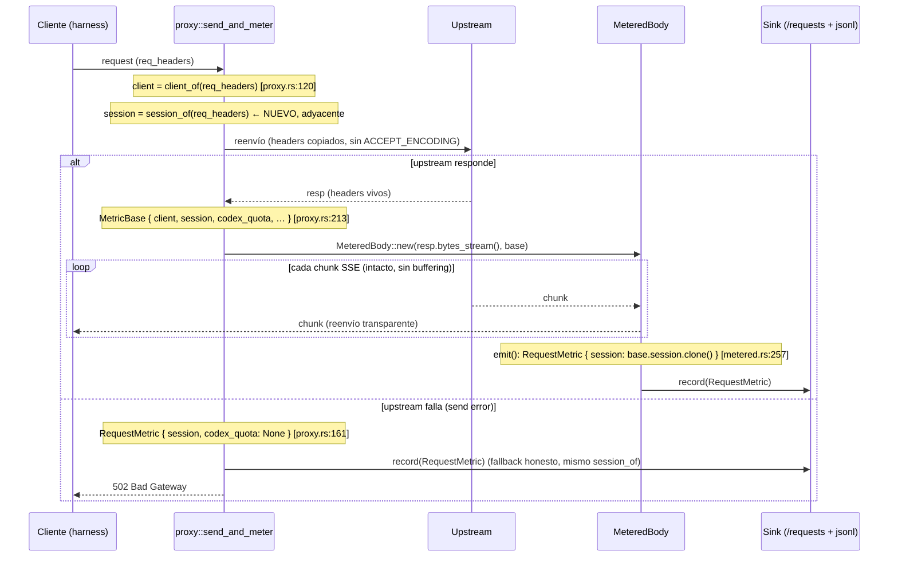

# Diseño: Eje de atribución de sesiones — Rebanada 1

## Enfoque técnico

La rebanada 1 resuelve una **clave de sesión** por precedencia sobre las
cabeceras del request entrante y la expone cruda por petición en `/requests` y
en `telemetry.jsonl`, sin agregar ni derivar nada. La resolución es transporte
puro: se computa en `src/middleware/proxy.rs::send_and_meter` **junto a
`client_of`**, aplicando la precedencia `X-OxideGate-Session` >
`x-claude-code-session-id` > fallback (`User-Agent` + bucket "unattributed"),
con **cero buffering y cero riesgo para el stream SSE** (solo lookups puntuales
de cabecera antes de que fluya la respuesta).

Se introduce **un único tipo de acarreo**, `SessionAttribution`, en un módulo
dedicado (`src/telemetry/session.rs`), que viaja como un solo campo `session`
por la misma cadena que ya recorren `client`, `tools_by_server` y `codex_quota`:
`MetricBase` → `RequestMetric` → `RecentRequest` → JSON de `/requests` +
línea de `telemetry.jsonl`.

Se diseña la **forma del eje completo** (para que las rebanadas 2‑3 —agregación
en `/stats` y panel TUI— no fuercen un rediseño), pero solo la rebanada 1 se
especifica al detalle.

## Diferencia estructural clave frente al precedente `codex_quota`

Ambos ejes se hilan por la misma cadena, pero **nacen en sitios distintos por
una razón arquitectónica, no por casualidad**:

| Eje | Fuente | Naturaleza | Dónde nace |
|-----|--------|-----------|------------|
| `codex_quota` | Cabeceras `x-codex-*` de la **respuesta** del upstream | **Dialecto de proveedor** (Codex OAuth) | Módulo dedicado `telemetry::codex_quota` (`from_headers`); `proxy.rs` solo hace una llamada |
| `session` (nuevo) | Cabeceras del **request** entrante (`X-OxideGate-Session`, `x-claude-code-session-id`, `User-Agent`) | **Transporte genérico** (precedencia sobre headers, sin dialecto) | Función `session_of` en `proxy.rs`, **junto a `client_of`** |

El precedente correcto para la resolución de sesión **no es `codex_quota` sino
`client_of`** (`proxy.rs:36`): ambas funciones leen el MISMO `&HeaderMap` del
request entrante e interpretan cabeceras de transporte, sin conocer ningún
proveedor. `codex_quota` se aisló en un módulo dedicado precisamente para
mantener el **dialecto Codex** (cabeceras de respuesta específicas de un
proveedor) fuera del transporte genérico —ver el comentario de `proxy.rs:231‑235`
y la decisión "parser dedicado, no inline" del diseño de cuota—. La resolución
de sesión **no tiene ningún dialecto que aislar**: es la misma categoría que
`client_of`, que ya vive inline en `proxy.rs`. Ponerla ahí es lo consistente.

## Decisiones de arquitectura

### Decisión 1: la resolución vive en `proxy.rs`, junto a `client_of` (no en el módulo del tipo)

**Elección**: una función libre `session_of(req_headers: &HeaderMap) ->
SessionAttribution` en `src/middleware/proxy.rs`, adyacente a `client_of`
(`proxy.rs:36`). Concentra la precedencia Y el saneo de string vacío.

**Alternativas consideradas**:
1. Constructor `SessionAttribution::resolve(&HeaderMap)` en
   `telemetry::session` (imitando `CodexQuota::from_headers`).
2. Parseo inline disperso en el literal de `MetricBase`.

**Justificación**:
- **Simetría con `client_of`** (factor decisivo): `session_of` es el hermano
  del lado-request de `client_of`. Ambos leen el mismo `req_headers` que
  `send_and_meter` ya recibe como parámetro (`proxy.rs:112`). Mantenerlos
  adyacentes concentra TODA la interpretación de cabeceras de request en un
  solo lugar del transporte.
- **Frontera del trait `Provider` respetada** (regla `rules.design` de
  `openspec/config.yaml`): `session_of` **no ramifica por proveedor** —no hay
  `match prov`, no inspecciona `out.upstream` ni el slug de modelo—. Lee tres
  cabeceras fijas por nombre con una precedencia fija. A diferencia de
  `codex_quota`, que parsea un dialecto de **respuesta** de un proveedor y por
  eso se quarantina, aquí no hay dialecto: `x-claude-code-session-id` se
  consume como **string opaca**, jamás se interpreta semántica de Claude. El
  transporte sigue siendo agnóstico del proveedor.
- **El tipo, en cambio, SÍ vive en `telemetry`**: `SessionAttribution` se hila
  por structs de telemetría (`MetricBase`, `RequestMetric`, `RecentRequest`),
  necesita `Serialize` y tests de round‑trip serde, exactamente como
  `CodexQuota`. El dato es telemetría; su resolución es transporte. La división
  es honesta: cada pieza vive donde pertenece.

**Tradeoff aceptado**: los tests de precedencia viven en `proxy.rs`
(`#[cfg(test)]`), no junto al tipo. Es coherente con el patrón del repo (tests
inline por módulo) y con que `client_of` también es lógica de `proxy.rs`.

### Decisión 2: forma anidada `SessionAttribution { source, key }`, no dos campos planos

**Elección**: un struct `SessionAttribution` con dos campos —un enum
`SessionSource` y una `String`— acarreado como **un solo campo `session`** por
estructura.

```
pub enum SessionSource { Explicit, Native, Unattributed }

pub struct SessionAttribution {
    pub source: SessionSource,   // QUÉ señal ganó la precedencia
    pub key: String,             // el valor opaco resuelto
}
```

**Alternativas consideradas**: dos campos planos (`session_key: String` +
`session_source: String`/enum) replicados en `MetricBase`, `RequestMetric` y
`RecentRequest`.

**Justificación**:
- **Cohesión semántica de honestidad** (factor decisivo): `source` y `key` son
  **inseparables para interpretar el dato**. Una `key` de `claude-cli/1.2.3`
  significa cosas opuestas según su `source`: con `Native` es una sesión real
  atribuida; con `Unattributed` es solo el `User-Agent` del fallback, NO una
  identidad. Encadenar ambos en un tipo hace la **invariante de honestidad
  estructural**: es imposible tener una clave sin su procedencia. Esto es más
  fuerte aquí que en `codex_quota` (donde el argumento decisivo era el
  presupuesto de doc de 12 campos): con solo dos subcampos, el driver es la
  semántica, no el conteo.
- **Envejece mejor para la rebanada 2** (`/stats` group-by): la agregación
  trata `metric.session` como una unidad direccionable —agrupa por
  `session.key` y colorea/segmenta por `session.source` (real vs. sin
  atribuir)—. Dos campos dispersos harían frágil ese group-by.
- **Precedente del proyecto**: `tools_by_server`
  (`Option<Vec<ToolServerBytes>>`) y `codex_quota` (`Option<CodexQuota>`) ya
  son campos anidados en `RequestMetric` (`logger.rs:185`, `logger.rs:234`).

**Consecuencia documental**: el doc‑comment de `RequestMetric::tools_by_server`
(`logger.rs:160`) hoy afirma que `tools_by_server` y `codex_quota` son "los DOS
campos no‑planos de la fila". `SessionAttribution` es un tercer campo no‑plano;
ese comentario y el de `codex_quota` (`logger.rs:220`) DEBEN actualizarse a
"tres campos no‑planos" en esta rebanada.

### Decisión 3: `session` NO es `Option` — el fallback es un valor real, no ausencia

**Elección**: el campo es `session: SessionAttribution` (no
`Option<SessionAttribution>`). La precedencia **siempre resuelve a algo**: la
peor rama es `SessionSource::Unattributed`, que es un bucket explícito, no
`None`.

**Justificación**:
- **Honestidad estructural**: no existe el caso "sin sesión". Existe "sesión
  asignada" (`Explicit`/`Native`) o "no atribuida" (`Unattributed`, un bucket
  nombrado). Modelarlo como `Option` colapsaría "no hubo header" con "no hay
  sesión" y perdería la señal que el eje existe para exponer. Contrasta a
  propósito con `codex_quota: Option<CodexQuota>`, donde `None` SÍ es honesto
  (el tráfico no‑Codex genuinamente no tiene cuota que reportar).
- **Consecuencia positiva en la rama de error de upstream**: como `req_headers`
  está disponible en AMBAS ramas de `send_and_meter`, `session_of` resuelve
  idéntico en el camino de error (`proxy.rs:161`) y en el de éxito
  (`proxy.rs:213`). No hay un `None` forzado por "no hubo respuesta" como en
  `codex_quota` (`proxy.rs:201`): la clave de sesión nace de la petición, que
  siempre existe. La rama de error obtiene su fallback honesto de forma natural,
  sin caso especial.

### Decisión 4: saneo de string vacío en el resolver, precedencia con caída limpia

`session_of` aplica el saneo `openspec/config.yaml` §privacidad ("string vacío
→ fallback/`None`, nunca `Some("")`") **descendiendo por la precedencia**:

| Orden | Cabecera | Regla de saneo |
|-------|----------|----------------|
| 1 | `X-OxideGate-Session` | Presente y **no vacía** (tras `trim`) → `source = Explicit`, `key = valor`. Ausente o vacía → cae al nivel 2. |
| 2 | `x-claude-code-session-id` | Presente y **no vacía** → `source = Native`, `key = valor`. Ausente o vacía → cae al fallback. |
| 3 | Fallback | `source = Unattributed`. `key = User-Agent` crudo cuando existe (reusa el criterio de `client_of`: tope de longitud, UTF‑8 válido); si el `User-Agent` falta o no es UTF‑8, `key` = constante `"unattributed"`. |

Reglas transversales: un header **presente pero vacío nunca crea identidad** —se
trata como ausente y se cae de nivel—; jamás `Some("")`; jamás una credencial
(el resolver lee SOLO esas tres cabeceras, nunca `Authorization`, `x-api-key`
ni `x-goog-api-key`). La composición exacta de la `key` del fallback (UA vs.
constante) es detalle de contrato de datos que fija `spec.md`; la **forma** del
tipo queda fijada aquí.

## Flujo de datos y punto de captura

### Diagrama de secuencia (resolución + hilado en `send_and_meter`)



**Propiedad SSE / cero‑buffering**: `session_of` hace 2‑3 lookups puntuales
sobre `req_headers` ANTES de construir `MeteredBody`, exactamente como
`client_of` (`proxy.rs:120`). No toca `resp`, no recorre ni bufferiza el stream,
no se piggybackea en el bucle de copia de cabeceras (`proxy.rs:242`). El camino
crítico del SSE queda intacto: `MeteredBody::poll_next` (`metered.rs:300`)
reenvía cada chunk sin modificar.

### Flujo de campo a campo (mismo patrón que `codex_quota`)

```
req_headers ── session_of ──▶ MetricBase.session
(proxy.rs:120/213)                   │
                                     ▼  (emit, metered.rs:257)
                          RequestMetric.session ──▶ telemetry.jsonl (logger, Serialize)
                                     │  (From, recent.rs:174)
                                     ▼
                          RecentRequest.session ──▶ /requests JSON
```

## Hilado campo a campo

| Sitio | Archivo:símbolo (línea aprox.) | Cambio |
|-------|--------------------------------|--------|
| Resolver | `middleware/proxy.rs` (junto a `client_of`, ~44) | nueva `fn session_of(&HeaderMap) -> SessionAttribution` (precedencia + saneo) |
| `MetricBase` | `telemetry/metered.rs::MetricBase` (~93) | nuevo campo `pub session: SessionAttribution` |
| Construcción `base` | `proxy.rs::send_and_meter` (~213, junto a `client`) | `session: session_of(req_headers)` (computado una vez al inicio, ~120) |
| Rama de error | `proxy.rs::send_and_meter` (~161) | `session: <la misma variable resuelta>` (fallback honesto natural) |
| `RequestMetric` | `telemetry/logger.rs::RequestMetric` (~234) | nuevo campo `pub session: SessionAttribution` |
| `MeteredBody::emit` | `telemetry/metered.rs` (~290) | `session: self.base.session.clone()` |
| `RecentRequest` | `telemetry/recent.rs::RecentRequest` (~167) | nuevo campo `pub session: SessionAttribution` |
| `RecentRequest::from` | `telemetry/recent.rs` (~205) | `session: m.session.clone()` |
| `/requests` handler | `middleware/requests.rs` | sin cambios (serializa el snapshot tal cual) |
| `telemetry.jsonl` writer | `telemetry/logger.rs` | sin cambios (`RequestMetric` deriva `Serialize`) |
| Fixture de tests | `telemetry/recent.rs::base_metric` (~250) | añadir `session` al literal |
| Doc no‑plano | `logger.rs:160` y `logger.rs:220` | actualizar "DOS campos no‑planos" → "TRES" |

**Sobre el `move` de `session`** (idéntico a `client`): se computa una vez al
inicio de `send_and_meter` y se **mueve** hacia el `RequestMetric` de la rama de
error O hacia el `MetricBase` de éxito. Como la rama de error hace `return`
antes de llegar al éxito (ver el comentario de `proxy.rs:168‑171` para `client`),
el análisis de flujo del compilador permite ambos usos como mutuamente
excluyentes. `SessionAttribution` no es `Copy` —igual que `client: String`—, así
que se aplica el mismo patrón sin clonar.

**Derives requeridos**: `SessionAttribution` y `SessionSource` derivan
`Debug, Clone, PartialEq, Serialize` (necesarios por los `.clone()` de traslado
en `emit`/`from` y por los round‑trips serde de los tests, igual que
`CodexQuota` en `codex_quota.rs:68`). `SessionSource` usa
`#[serde(rename_all = "snake_case")]` → `"explicit"` / `"native"` /
`"unattributed"`.

## Cambios de archivos

| Archivo | Acción | Descripción |
|---------|--------|-------------|
| `src/telemetry/session.rs` | Crear | Tipos `SessionAttribution` + `SessionSource` con `//!`/`///` explicativos (contrato de saneo y honestidad documentados UNA vez en el `//!`) |
| `src/telemetry/mod.rs` | Modificar | `pub mod session;` + `pub use session::{SessionAttribution, SessionSource};` (mismo patrón que `codex_quota`, `mod.rs:2/9`) |
| `src/middleware/proxy.rs` | Modificar | `fn session_of` + captura en `base` + resolución en rama de error |
| `src/telemetry/metered.rs` | Modificar | Campo en `MetricBase` + traslado en `emit` |
| `src/telemetry/logger.rs` | Modificar | Campo en `RequestMetric` + actualizar doc "no‑plano" |
| `src/telemetry/recent.rs` | Modificar | Campo en `RecentRequest` + `From` + `base_metric` de tests |

## Invariante de privacidad (garantía estructural)

- `session_of` lee EXCLUSIVAMENTE `X-OxideGate-Session`,
  `x-claude-code-session-id` y `User-Agent`. No toca ninguna cabecera de auth.
  La `key` es una etiqueta/identificador opaco, jamás una credencial cruda.
- `SessionSource::Unattributed` hace imposible confundir un fallback con una
  sesión asignada: la procedencia viaja pegada al valor, por construcción.
- `RecentRequest` ya excluye `prompt_hash`/`prompt_bytes` (`recent.rs:170‑173`);
  `session` no reintroduce contenido de prompt —es la etiqueta de origen del
  request, no su contenido—, coherente con la invariante del header de
  `recent.rs` y con `docs/telemetry-per-request.md`.

## Estrategia de pruebas

| Capa | Qué | Cómo |
|------|-----|------|
| Unit | `session_of`: precedencia (Explicit gana sobre Native gana sobre fallback), vacío→cae de nivel (nunca `Some("")`), sin ningún header→`Unattributed` con UA, sin UA→`key = "unattributed"` | tests en `proxy.rs` con `HeaderMap` sintéticos |
| Unit | Proyección `RequestMetric`→`RecentRequest` copia `session` fiel (los tres `source`) | ampliar tests de `recent.rs` (patrón `proyeccion_copia_..._fielmente`) |
| Unit | Round‑trip serde de `RecentRequest`/`RequestMetric` con `session` para cada `SessionSource` | patrón existente `round_trip_serde_con_codex_quota_presente` (`recent.rs:431`) |

## Visión del eje completo (rebanadas 2‑3) — no bloqueado

- **`/stats` (2)**: `StatsRegistry::ingest` ya recibe `&RequestMetric`; leerá
  `metric.session` como unidad para el group-by (`session.key` como clave de
  grupo, `session.source` para segmentar real vs. sin atribuir). Sin reshape.
- **Monitor TUI (3)**: nueva vista/columna de sesión sobre datos ya presentes
  en `/requests`/`/stats`, mismo patrón que el panel de cuota de Codex (tecla
  `u`) o el ciclo de vistas `c` del monitor.

La forma anidada (`session` como unidad) envejece mejor porque cada rebanada
derivada trata la atribución como un bloque direccionable.

## Preguntas abiertas

- [ ] Composición exacta de la `key` del fallback (`User-Agent` crudo vs.
  constante `"unattributed"` vs. ambos): la **forma** del tipo queda fijada aquí;
  el valor exacto lo cierra `spec.md`. No bloquea la arquitectura.
- [ ] Validación en vivo de que OpenCode/Gemini propagan `X-OxideGate-Session`:
  es tarea DEL slice (validar contra el propio proxy), no precondición del
  diseño —el diseño no depende de ningún harness concreto (ver riesgos de
  `proposal.md`).
